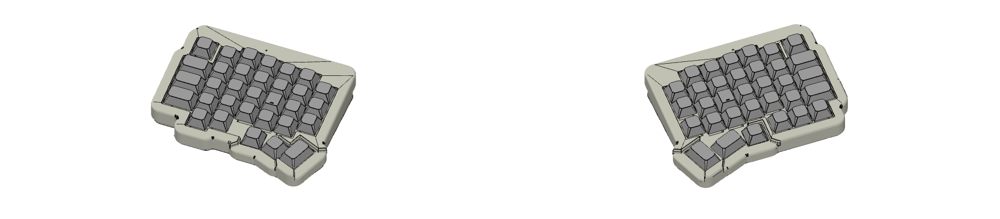

# v2

Generated by [Auto-Keyboard-Design-Kit](https://auto-kdk.pages.dev/)

## Preview

- 3D View

- Top View

## Parts List

|Part|Quantity|
|---|---|
|wireless controller|2|
|Conthrough(2.5mm, 9pin)|4|
|Battery|2|
USB-C cable|1|
|MX switch and MX socket|59|
|Choc V2 switch and Choc socket|6|
|Diode|65|
|Keycap|65|

